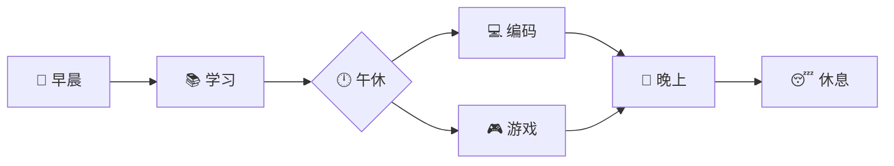

<h1 align="center">
  
</h1>

  

<h2 align="center">一个热爱技术的 IT 玩家 🚀</h2>

 

 
 🔭 我目前正在 **温州外国语学校** 学习
 
 🌱 正在学习 **前端开发 & 服务器管理**
 
 👯 希望合作 **有趣的开源项目**
 
 🤔 需要帮助 **JavaScript 和云服务**
 
 💬 可以问我关于 **Web开发 和 游戏相关** 的问题
 
 ⚡ 有趣的事实：**基尼奇厨 | 米家游戏玩家 | 服务器就用雨云**
 
 

 

 

<h2 align="center">🔥 技术栈 & 工具 🔥</h2>
 

    
     
    
     
    

 

<h2 align="center">📊 GitHub 统计数据 📊</h2>
 

   
  

 

  

 

<h2 align="center">📫 联系我 📫</h2>
 

  

 

<h2 align="center">🌐 我的网站 🌐</h2>
 

  

 

<h2 align="center">💻 工作环境 💻</h2>
 

  

 

<h2 align="center">🎮 游戏 & 爱好 🎮</h2>
 

  

 

<h2 align="center">🕒 每日活动时间表 🕒</h2>
 

<picture> <source media="(prefers-color-scheme: dark)" srcset="https://raw.githubusercontent.com/Tartaglia770/Tartaglia770/output/github-contribution-grid-snake-dark.svg">  </picture>
 

  
---
⭐ 来自 [今日泷体不适](https://github.com/Tartaglia770) 

